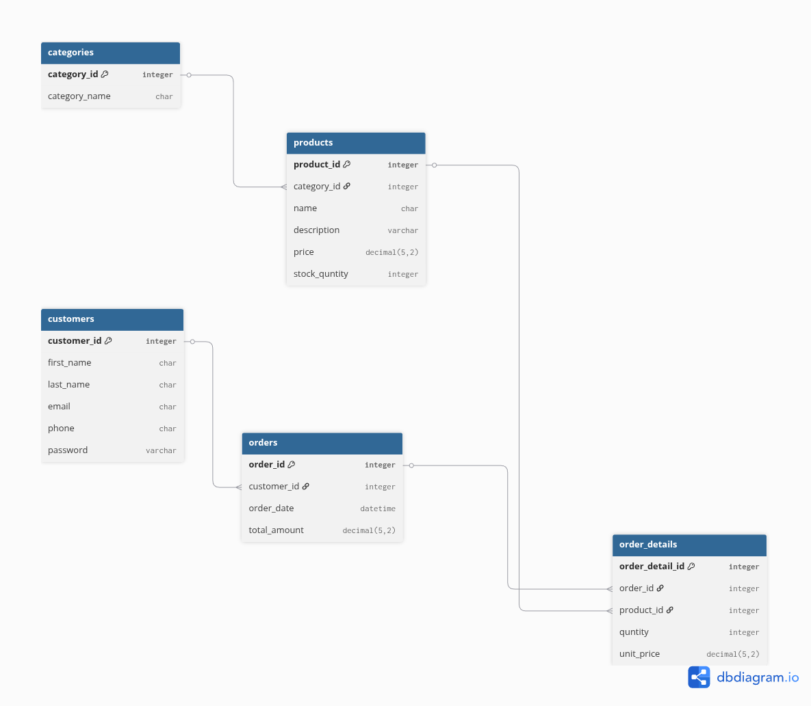

# E-commerce-DB

E-commerce database project containing schema, seed data, and reporting queries.

## Tables

The database has 5 tables:

1. categories
2. customers
3. products
4. orders
5. order_details

## Relations

1. categories (1) -> (N) products

- One category can have many products.

2. customers (1) -> (N) orders

- One customer can place many orders.

3. orders (1) -> (N) order_details

- One order can have many order detail rows.

4. products (1) -> (N) order_details

- One product can appear in many order detail rows.

## ERD



## Create Schema

1. [create-scheam.sql](create-scheam.sql) - Creates all tables and foreign key relations

```sql
CREATE TABLE categories (
	category_id INTEGER PRIMARY KEY AUTO_INCREMENT,
	category_name CHAR(255)
);

CREATE TABLE customers (
	customer_id INTEGER PRIMARY KEY AUTO_INCREMENT,
	first_name CHAR(255),
	last_name CHAR(255),
	email CHAR(255),
	phone CHAR(255),
	password VARCHAR(255)
);

CREATE TABLE products (
	product_id INTEGER PRIMARY KEY AUTO_INCREMENT,
	category_id INTEGER,
	name CHAR(255),
	description VARCHAR(255),
	price DECIMAL(5, 2),
	stock_quantity INTEGER,
	FOREIGN KEY (category_id) REFERENCES categories(category_id)
);

CREATE TABLE orders (
	order_id INTEGER PRIMARY KEY AUTO_INCREMENT,
	customer_id INTEGER,
	order_date DATETIME,
	total_amount DECIMAL(5, 2),
	FOREIGN KEY (customer_id) REFERENCES customers(customer_id)
);

CREATE TABLE order_details (
	order_detail_id INTEGER PRIMARY KEY AUTO_INCREMENT,
	order_id INTEGER,
	product_id INTEGER,
	quantity INTEGER,
	unit_price DECIMAL(5, 2),
	FOREIGN KEY (order_id) REFERENCES orders(order_id),
	FOREIGN KEY (product_id) REFERENCES products(product_id)
);
```

## Data

1. [data.sql](data.sql) - Inserts sample data into all tables

```sql
INSERT INTO categories (category_name) VALUES
('Electronics'),
('Clothing'),
('Home & Kitchen');

INSERT INTO customers (first_name, last_name, email, phone, password) VALUES
('Ahmed', 'Ali', 'ahmed@email.com', '123456789', 'hashed_pass_1'),
('Sara', 'Mohamed', 'sara@email.com', '987654321', 'hashed_pass_2'),
('John', 'Doe', 'john.d@email.com', '555000111', 'hashed_pass_3');


INSERT INTO products (category_id, name, description, price, stock_quantity) VALUES
(1, 'Smartphone', 'High-end mobile device', 899.99, 50),
(1, 'Wireless Buds', 'Noise-cancelling earphones', 149.50, 100),
(2, 'Cotton T-Shirt', 'Premium organic cotton', 25.00, 200),
(3, 'Coffee Maker', 'Programmable drip coffee machine', 75.25, 30);


INSERT INTO orders (customer_id, order_date, total_amount) VALUES
(1, '2024-07-19 10:00:00', 924.99),
(3, '2026-04-10 14:30:00', 149.50),
(2, '2026-04-18 09:15:00', 100.25),
(1, '2026-04-18 16:45:00', 1799.98);

INSERT INTO order_details (order_id, product_id, quantity, unit_price) VALUES
(1, 1, 1, 899.99),
(1, 3, 1, 25.00),
(2, 2, 1, 149.50),
(3, 3, 1, 25.00),
(3, 4, 1, 75.25),
(4, 1, 2, 899.99);
```

## Queries

1. [queries.sql](queries.sql) - Contains reporting and analytics queries

```sql
-- 1- Daily Revenue Calculation
SELECT
		'2025-04-18' AS revenue_date,
		SUM(total_amount) AS daily_revenue
FROM `E-commerce-DB`.orders
WHERE order_date >= '2025-04-18' AND order_date < '2025-04-19';

-- 2- Top Selling Products
SELECT
p.name,
sum(od.quantity) AS total_quantity
FROM products p
JOIN order_details od on p.product_id = od.product_id
JOIN orders o on  od.order_id = o.order_id
WHERE o.order_date >= '2025-04-01'
	AND o.order_date < '2025-05-01'
	group by od.product_id
	order by total_quantity DESC

-- 3- Customers Who Spent More Than $500 in the Last Month
SELECT
		CONCAT(c.first_name, ' ', c.last_name) AS customer_name,
		SUM(o.total_amount) AS total_spent
FROM customers c
JOIN orders o ON o.customer_id = c.customer_id
WHERE o.order_date >= CURRENT_DATE - INTERVAL 1 MONTH
GROUP BY c.customer_id, c.first_name, c.last_name
HAVING total_spent > 500
ORDER BY total_spent DESC;
```

## Denormalization

For denormalization mechanism on customer and order entities we can add customer columns into the order entity which would make reading data faster as there is no need to join another table however this would duplicate customer data and if the customer need to update its data then it would required to update all rows containing that customer which would take time, also if the we want to delete the order then the data of customer no longer exist
