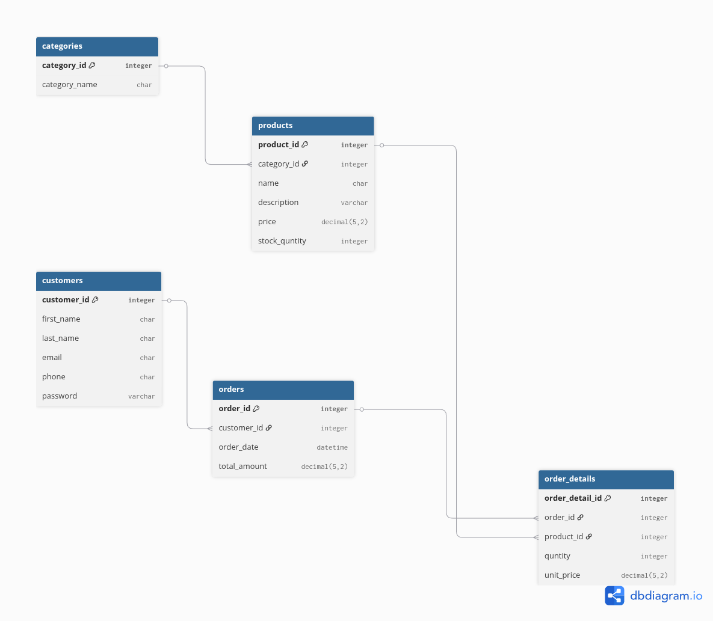
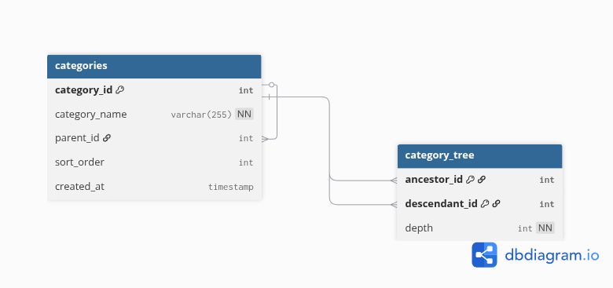

# E-commerce-DB

E-commerce database project containing schema, seed data, and reporting queries.

## Tables

The database has 5 tables:

1. categories
2. customers
3. products
4. orders
5. order_details

## Relations

1. categories (1) -> (N) products

- One category can have many products.

2. customers (1) -> (N) orders

- One customer can place many orders.

3. orders (1) -> (N) order_details

- One order can have many order detail rows.

4. products (1) -> (N) order_details

- One product can appear in many order detail rows.

## ERD



## Create Schema

1. [create-scheam.sql](create-scheam.sql) - Creates all tables and foreign key relations

```sql
CREATE TABLE categories (
	category_id INTEGER PRIMARY KEY AUTO_INCREMENT,
	category_name CHAR(255)
);

CREATE TABLE customers (
	customer_id INTEGER PRIMARY KEY AUTO_INCREMENT,
	first_name CHAR(255),
	last_name CHAR(255),
	email CHAR(255),
	phone CHAR(255),
	password VARCHAR(255)
);

CREATE TABLE products (
	product_id INTEGER PRIMARY KEY AUTO_INCREMENT,
	category_id INTEGER,
	name CHAR(255),
	description VARCHAR(255),
	price DECIMAL(5, 2),
	stock_quantity INTEGER,
	FOREIGN KEY (category_id) REFERENCES categories(category_id)
);

CREATE TABLE orders (
	order_id INTEGER PRIMARY KEY AUTO_INCREMENT,
	customer_id INTEGER,
	order_date DATETIME,
	total_amount DECIMAL(5, 2),
	FOREIGN KEY (customer_id) REFERENCES customers(customer_id)
);

CREATE TABLE order_details (
	order_detail_id INTEGER PRIMARY KEY AUTO_INCREMENT,
	order_id INTEGER,
	product_id INTEGER,
	quantity INTEGER,
	unit_price DECIMAL(5, 2),
	FOREIGN KEY (order_id) REFERENCES orders(order_id),
	FOREIGN KEY (product_id) REFERENCES products(product_id)
);
```

## Data

1. [data.sql](data.sql) - Inserts sample data into all tables

```sql
INSERT INTO categories (category_name) VALUES
('Electronics'),
('Clothing'),
('Home & Kitchen');

INSERT INTO customers (first_name, last_name, email, phone, password) VALUES
('Ahmed', 'Ali', 'ahmed@email.com', '123456789', 'hashed_pass_1'),
('Sara', 'Mohamed', 'sara@email.com', '987654321', 'hashed_pass_2'),
('John', 'Doe', 'john.d@email.com', '555000111', 'hashed_pass_3');


INSERT INTO products (category_id, name, description, price, stock_quantity) VALUES
(1, 'Smartphone', 'High-end mobile device', 899.99, 50),
(1, 'Wireless Buds', 'Noise-cancelling earphones', 149.50, 100),
(2, 'Cotton T-Shirt', 'Premium organic cotton', 25.00, 200),
(3, 'Coffee Maker', 'Programmable drip coffee machine', 75.25, 30);


INSERT INTO orders (customer_id, order_date, total_amount) VALUES
(1, '2024-07-19 10:00:00', 924.99),
(3, '2026-04-10 14:30:00', 149.50),
(2, '2026-04-18 09:15:00', 100.25),
(1, '2026-04-18 16:45:00', 1799.98);

INSERT INTO order_details (order_id, product_id, quantity, unit_price) VALUES
(1, 1, 1, 899.99),
(1, 3, 1, 25.00),
(2, 2, 1, 149.50),
(3, 3, 1, 25.00),
(3, 4, 1, 75.25),
(4, 1, 2, 899.99);
```

## Queries

1. [queries.sql](queries.sql) - Contains reporting and analytics queries

```sql
-- 1- Daily Revenue Calculation
SELECT
		'2025-04-18' AS revenue_date,
		SUM(total_amount) AS daily_revenue
FROM `E-commerce-DB`.orders
WHERE order_date >= '2025-04-18' AND order_date < '2025-04-19';

-- 2- Top Selling Products
SELECT
p.name,
sum(od.quantity) AS total_quantity
FROM products p
JOIN order_details od on p.product_id = od.product_id
JOIN orders o on  od.order_id = o.order_id
WHERE o.order_date >= '2025-04-01'
	AND o.order_date < '2025-05-01'
	group by od.product_id
	order by total_quantity DESC

-- 3- Customers Who Spent More Than $500 in the Last Month
SELECT
		CONCAT(c.first_name, ' ', c.last_name) AS customer_name,
		SUM(o.total_amount) AS total_spent
FROM customers c
JOIN orders o ON o.customer_id = c.customer_id
WHERE o.order_date >= CURRENT_DATE - INTERVAL 1 MONTH
GROUP BY c.customer_id, c.first_name, c.last_name
HAVING total_spent > 500
ORDER BY total_spent DESC;


-- 4- Search products table avoiding (%) in first index can be used by Query Optimizer
SELECT * FROM `E-commerce-DB`.products
WHERE name LIKE 'camera%'
OR description LIKE 'camera%';

-- 5-recommend popular products in the same category for the same author,
-- excluding the Purchased product from the recommendations for a customer(used cte for readability and maintainability rather than using subquery)

WITH UserProductSales AS (
   SELECT p.product_id, p.category_id
   FROM products p
   JOIN order_details od ON od.product_id = p.product_id
   JOIN `orders` o ON od.order_id = o.order_id
   WHERE o.customer_id = 6001
   group by p.product_id,p.category_id
),

UserProductCategories AS (
SELECT distinct ups.category_id
FROM UserProductSales ups
)

SELECT p.* FROM products p
join UserProductCategories upc ON upc.category_id = p.category_id
LEFT join UserProductSales ups ON ups.product_id = p.product_id
where ups.product_id IS null

```

## Denormalization

For denormalization mechanism on customer and order entities we can add customer columns into the order entity which would make reading data faster as there is no need to join another table however this would duplicate customer data and if the customer need to update its data then it would required to update all rows containing that customer which would take time, also if the we want to delete the order then the data of customer no longer exist

## Hierarchical Categories (Closure Table Pattern)

To address the challenge of representing categories with self-relational subcategories with arbitrary depths, we can implement the Closure Table approach.

The `categories` table includes a `parent_id`, and a new `category_tree` table is introduced to store all paths between ancestors and descendants.

**Schema updates:**

- `categories` (category_id, category_name, parent_id)
- `category_tree` (ancestor_id, descendant_id, depth)



### Fetching Subcategories

We can fetch subcategories of a specific category easily by joining both tables. We can also limit the depth:

```sql
SELECT c.category_id, c.category_name, c.parent_id
FROM categories c
JOIN category_tree t ON c.category_id = t.descendant_id
WHERE t.ancestor_id = 1
  AND t.depth > 0;
  -- we can also specify the depth e.g. AND t.depth < 4
```

Since each row contains its `parent_id`, mapping them correctly to display the hierarchy on the UI is straightforward.

### Inserting a New Category

When inserting a new category, first insert it into the `categories` table. Then, update the `category_tree`. For example, if the newly created category has `id = 5` and its parent is `2`:

```sql
-- Link the new category (e.g. 5) to all of its parent's (e.g. 2) ancestors, and link to itself
INSERT INTO category_tree (ancestor_id, descendant_id, depth)
SELECT ancestor_id, 5, depth + 1
FROM category_tree
WHERE descendant_id = 2 -- The parent category ID
UNION ALL
SELECT 5, 5, 0;         -- Self-relation entry
```

### Caching Strategy

Since the read-to-write ratio for category trees is typically very high (frequent reads, rare updates), we can store the structured map in a Redis cache. This way, we avoid hitting the database and executing these joins every time the user requests the category navigation tree.

## Seed `user_info` with Stored Procedure (5,000,000 rows)

This repository includes a stored procedure to create and seed a `user_info` table with large volumes (example: 5,000,000 rows).

1. [stored-procedures/seed-user-info.sql](stored-procedures/seed-user-info.sql) — stored procedure that creates/seeds `user_info`

```sql
DELIMITER $$

DROP PROCEDURE IF EXISTS CreateAndSeedUserInfo$$

CREATE PROCEDURE CreateAndSeedUserInfo()
BEGIN
    -- 1. Declare iteration control variables
    DECLARE i INT DEFAULT 1;
    DECLARE total_rows INT DEFAULT 5000000;
    DECLARE batch_size INT DEFAULT 10000;

    -- 2. Performance Tuning: Optimize session settings for massive data loading
    SET max_execution_time = 0;         -- Prevent script timeout
    SET FOREIGN_KEY_CHECKS = 0;         -- Disable constraint checking during insertion
    SET UNIQUE_CHECKS = 0;              -- Disable uniqueness checking during insertion
    SET AUTOCOMMIT = 0;                 -- Handle transactions manually in batches

    -- 3. Dynamic DDL: Fresh start for the table
    DROP TABLE IF EXISTS userinfo;

    CREATE TABLE userinfo (
        id INT UNSIGNED NOT NULL AUTO_INCREMENT,
        name VARCHAR(64) NOT NULL DEFAULT '',
        email VARCHAR(128) NOT NULL DEFAULT '',
        password VARCHAR(64) NOT NULL DEFAULT '',
        dob DATE NOT NULL,
        address VARCHAR(255) NOT NULL DEFAULT '',
        city VARCHAR(64) NOT NULL DEFAULT '',
        state_id INT UNSIGNED NOT NULL DEFAULT 0,
        zip VARCHAR(10) NOT NULL DEFAULT '',
        country_id INT UNSIGNED NOT NULL DEFAULT 1,
        account_type VARCHAR(20) NOT NULL DEFAULT 'standard',
        closest_airport VARCHAR(3) NOT NULL DEFAULT 'LAX',
        PRIMARY KEY (id)
    ) ENGINE=InnoDB DEFAULT CHARSET=utf8mb4 COLLATE=utf8mb4_unicode_ci;

    -- 4. The Seeding Loop
    WHILE i <= total_rows DO

        -- Insert a synthetic user profile
        INSERT INTO userinfo (name, email, password, dob, address, city, state_id, zip, account_type, closest_airport)
        VALUES (
            ELT(FLOOR(1 + RAND() * 5), 'Alice', 'Bob', 'Charlie', 'David', 'Eva'),
            CONCAT('user', i, '@example.com'),
            SHA2(CONCAT('password_secret_', i), 256), -- Simulating hashed passwords
            DATE_ADD('1970-01-01', INTERVAL FLOOR(RAND() * 18250) DAY), -- Random DOB over 50 years
            CONCAT(FLOOR(100 + RAND() * 8900), ' Main St'),
            ELT(FLOOR(1 + RAND() * 4), 'Tech City', 'Metroville', 'Gotham', 'Star City'),
            FLOOR(1 + RAND() * 50), -- Random state_id (1-50) for low-cardinality skewing
            LPAD(FLOOR(RAND() * 99999), 5, '0'),
            ELT(FLOOR(1 + RAND() * 3), 'standard', 'premium', 'trial'),
            ELT(FLOOR(1 + RAND() * 5), 'LAX', 'JFK', 'ORD', 'SFO', 'DXB')
        );

        -- 5. Batch Commit trigger
        IF MOD(i, batch_size) = 0 THEN
            COMMIT; -- Flush 10,000 records out of memory to disk
        END IF;

        SET i = i + 1;
    END WHILE;

    -- Commit any remaining records if total_rows isn't perfectly divisible by batch_size
    COMMIT;

    -- 6. Re-enable safety checks after execution is complete
    SET FOREIGN_KEY_CHECKS = 1;
    SET UNIQUE_CHECKS = 1;
    SET AUTOCOMMIT = 1;

END$$

DELIMITER ;
```

## Files

## Seed Data Table

| Table Name    | Number of Rows |
| ------------- | -------------: |
| categories    |        100,000 |
| products      |      5,000,000 |
| customers     |      5,000,000 |
| orders        |     20,000,000 |
| order_details |     50,000,000 |

## SQL Queries Before & After Optimization

### Query 1: Retrieve the total number of products in each category

**Query:**

```sql
SELECT C.category_id, C.category_name, COUNT(product_id) AS total_products
FROM categories C
JOIN products P
ON C.category_id = P.category_id
GROUP BY P.category_id;
```

**Execution Time Before Optimization:** 1200 ms

**Execution Time After Optimization:** 400 ms

**Optimization Techniques:**

- Rewrote the query to use a CTE that aggregates product counts first.
- Reduced the amount of work done during the join by using a temporary aggregated result.
- A further improvement could be denormalization by adding a `products_count` column to `categories`, but that would require maintaining the column on inserts and deletes.

**Supporting Index Syntax:**

```sql
CREATE INDEX idx_products_category_id ON products(category_id);
```

**Optimized Query:**

```sql
WITH ProductCounts AS (
    SELECT category_id, COUNT(product_id) AS total_products
    FROM products
    GROUP BY category_id
)
SELECT
    C.category_id,
    C.category_name,
    COALESCE(PC.total_products, 0) AS total_products
FROM categories C
LEFT JOIN ProductCounts PC ON C.category_id = PC.category_id;
```

### Query 2: Top Customers by Total Spending

**Query:**

```sql
EXPLAIN ANALYZE
SELECT c.customer_id, c.first_name, SUM(o.total_amount) AS total_spent
FROM customers c
JOIN orders o
ON c.customer_id = o.customer_id
GROUP BY c.customer_id, c.first_name
ORDER BY total_spent DESC
LIMIT 10;
```

**Execution Time Before Optimization:** 80,000 ms

**Execution Time After Optimization:** 500 ms

**Optimization Techniques:**

- Denormalized the frequent aggregation by adding a `total_spent` column on `customers`.
- Added a covering index on `(customer_id, first_name, total_spent)` to support an index-only scan.
- If real-time freshness is not required, a materialized view or cache can serve these results even faster.

**Index Syntax:**

```sql
CREATE INDEX idx_customers_customer_first_total_spent
ON customers (customer_id, first_name, total_spent);
```

**Optimized Query:**

```sql
SELECT customer_id,
       first_name,
       total_spent
FROM customers
GROUP BY customer_id, first_name
ORDER BY first_name DESC
LIMIT 10;
```

### Query 3: Most Recent Orders with Customer Information (1000 Orders)

**Query:**

```sql
SELECT
    O.order_id,
    O.order_date,
    O.total_amount,
    C.customer_id,
    C.first_name,
    C.last_name,
    C.email
FROM orders O
INNER JOIN customers C ON O.customer_id = C.customer_id
ORDER BY O.order_date DESC
LIMIT 1000;
```

**Execution Time Before Optimization:** 10,000 ms

**Execution Time After Optimization:** 900 ms

**Optimization Techniques:**

- Added a covering index on `(order_date, customer_id)`.

**Index Syntax:**

```sql
CREATE INDEX idx_orders_order_date_customer_id
ON orders (order_date, customer_id);
```

### Query 4: List products that have low stock quantities of less than 10 quantities

**Query:**

```sql
SELECT
    product_id,
    name,
    stock_quantity
FROM products p
WHERE stock_quantity < 10
ORDER BY stock_quantity ASC;
```

**Execution Time Before Optimization:** 500 ms

**Execution Time After Optimization:** 160 ms

**Optimization Techniques:**

- Added a conditional index on `stock_quantity` for rows where the quantity is less than 10.

**Index Syntax:**

```sql
CREATE INDEX idx_products_stock_quantity
ON products (stock_quantity);
```

### Query 5: Revenue Generated by Each Product Category

**Query:**

```sql
SELECT
    c.category_id,
    c.category_name,
    SUM(od.quantity * od.unit_price) AS total_revenue
FROM categories c
JOIN products p
    ON p.category_id = c.category_id
JOIN order_details od
    ON od.product_id = p.product_id
GROUP BY
    c.category_id,
    c.category_name
ORDER BY total_revenue DESC;
```

**Execution Time Before Optimization:** 45,000 ms

**Execution Time After Optimization:** 280 ms

**Optimization Techniques:**

- Used a materialized view to precompute revenue by category.
- This reduces repeated aggregation work across categories, products, and order details.

**Materialized View Syntax:**

```sql
CREATE MATERIALIZED VIEW category_revenue_mv AS
SELECT
    c.category_id,
    c.category_name,
    SUM(od.quantity * od.unit_price) AS total_revenue
FROM categories c
JOIN products p
    ON p.category_id = c.category_id
JOIN order_details od
    ON od.product_id = p.product_id
GROUP BY
    c.category_id,
    c.category_name;
```

## Final Optimization Summary

| Query Description                                                       | Time Before Optimization | Optimization Techniques                                                                                                                                      | Time After Optimization |
| ----------------------------------------------------------------------- | -----------------------: | ------------------------------------------------------------------------------------------------------------------------------------------------------------ | ----------------------: |
| Retrieve the total number of products in each category                  |                  1200 ms | Rewrote the query to use a CTE and aggregate first; a denormalized `products_count` column is a possible further enhancement                                 |                  400 ms |
| Top Customers by Total Spending                                         |                80,000 ms | Denormalized the total spending value on `customers`, added a covering index, and can use a materialized view or cache if real-time results are not required |                0.500 ms |
| Most Recent Orders with Customer Information (1000 Orders)              |                10,000 ms | Added a covering index on `(order_date, customer_id)`                                                                                                        |                  900 ms |
| List products that have low stock quantities of less than 10 quantities |                   500 ms | Added a conditional index on `stock_quantity` for rows where the quantity is less than 10                                                                    |                  160 ms |
| Revenue Generated by Each Product Category                              |                45,000 ms | Used a materialized view to precompute category revenue                                                                                                      |                  280 ms |
